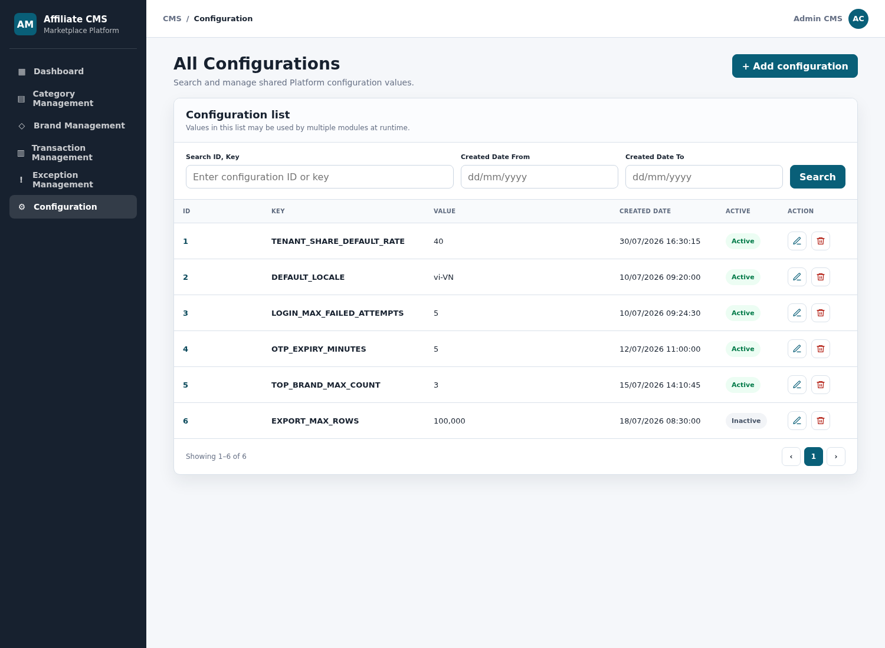
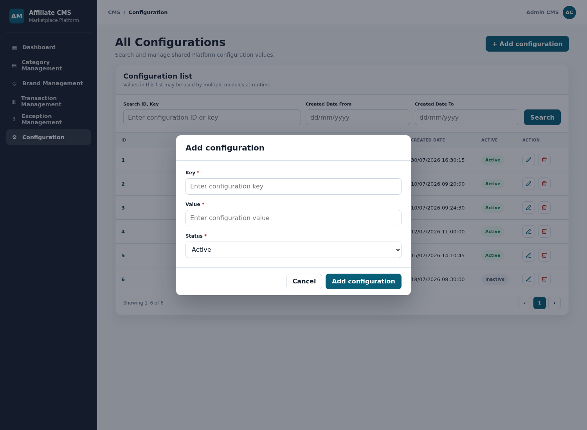
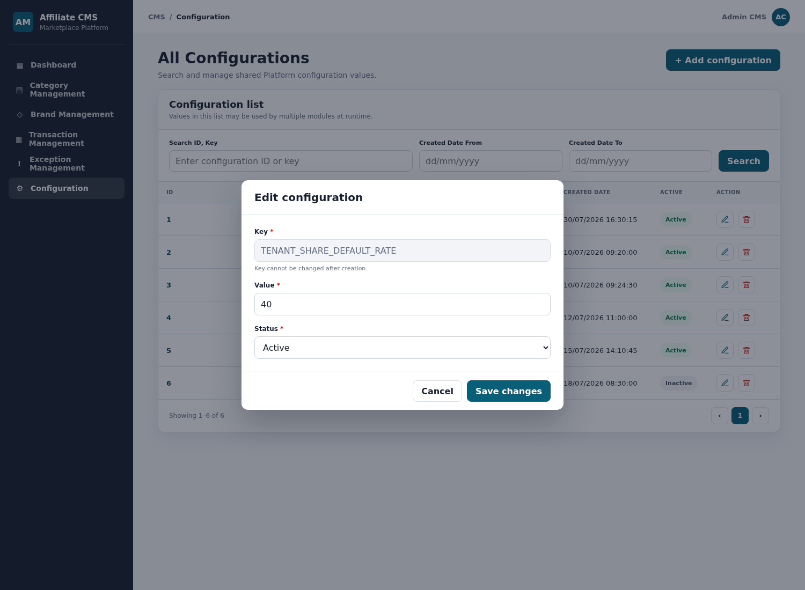

# SRS - CMS Configuration Management

## Changes Record

Note: A - Add/Create new, M - Modify, D - Delete

| Date of change | Reason (A, M, D) | Updated by | Old version | Description of change | New version |
|---|---|---|---|---|---|
| 2026-07-30 | A | Product/BA | -- | Create SRS for CMS Configuration Management based on the approved mockup. | 1.0.0 |
| 2026-07-30 | M | Product/BA | 1.0.0 | Make Configuration Key immutable and read-only on Edit. | 1.0.1 |

## Table of Contents

- I. Introduction
- II. Overall Description
- III. Overview
- IV. Description of Functions
- V. Data Requirements
- VI. Consolidated Business Rules Summary
- VII. Non-functional Requirements
- VIII. Consolidated Acceptance Criteria Summary
- IX. Open Questions

# I. Introduction

## 1. Purpose of Document

Tài liệu mô tả yêu cầu nghiệp vụ và phần mềm cho chức năng **Configuration** trên Admin CMS. Chức năng cho phép Admin CMS tra cứu và quản lý các cấu hình dùng chung của Platform thông qua cặp `Key` - `Value`.

## 2. Document Conventions

| Convention | Description |
|---|---|
| Configuration | Một cấu hình dùng chung của Platform. |
| Key | Mã kỹ thuật duy nhất dùng để nhận diện cấu hình. |
| Value | Giá trị cấu hình được lưu dưới dạng chuỗi; module sử dụng phải diễn giải theo định nghĩa của từng Key. |
| Active | Cấu hình có hiệu lực và được phép sử dụng tại runtime. |
| Inactive | Cấu hình được lưu nhưng không được sử dụng tại runtime. |
| Required | Trường bắt buộc nhập. |
| R/O | Required/Optional trong bảng mô tả trường. |
| Audit Log | Lịch sử thao tác Add, Edit hoặc Delete Configuration. |

## 3. Project Scope

### 3.1 In Scope

| Feature | Description |
|---|---|
| Configuration List | Hiển thị danh sách cấu hình dùng chung. |
| Search | Tìm theo ID hoặc Key; lọc theo khoảng Created Date. |
| Add Configuration | Tạo cấu hình mới gồm Key, Value và Status. |
| Edit Configuration | Xem Key dạng read-only và chỉnh sửa Value, Status của cấu hình đã chọn. |
| Delete Configuration | Xác nhận và xóa cấu hình. |
| Authorization | Chỉ Admin CMS có quyền truy cập và thao tác Configuration theo Permission Matrix hiện tại. |
| Audit | Ghi Audit Log cho Add, Edit và Delete. |

### 3.2 Out of Scope

| Item | Reason |
|---|---|
| Quản lý cấu trúc dữ liệu riêng cho từng Key | Mỗi module chịu trách nhiệm định nghĩa cách diễn giải Value của Key mà module sử dụng. |
| Import/Export Configuration | Mockup và phạm vi hiện tại chưa có thao tác này. |
| Versioning/Rollback giao diện | Chưa có màn hình xem hoặc phục hồi phiên bản cấu hình. |
| Phân quyền Configuration cho role ngoài Admin CMS | Permission Matrix hiện tại chỉ cấp quyền cho Admin CMS. |

## 4. Expected Results After Finishing This Document

- Thống nhất màn danh sách, tìm kiếm, Add, Edit và Delete Configuration.
- Thống nhất nguồn dữ liệu, validation và trạng thái hiệu lực.
- Làm rõ cách module khác đọc cấu hình tại runtime.
- Làm cơ sở cho thiết kế API, database, authorization, audit và kiểm thử.

## 5. References

| Document/Mockup | Location |
|---|---|
| Configuration mockup | [cms-all-configuration.html](../mockups/cms-all-configuration.html) |
| CMS Role and Permission Matrix | [cms-role-permission-management-module-04-template.md](cms-role-permission-management-module-04-template.md) |
| Audit Log SRS | [audit-log-module-04-template.md](audit-log-module-04-template.md) |
| Platform SRS | [affiliate-marketplace-platform.md](affiliate-marketplace-platform.md) |

# II. Overall Description

## 1. Definition

| Name | Description |
|---|---|
| Configuration ID | ID số do hệ thống tự sinh khi tạo bản ghi. |
| Configuration Key | Mã kỹ thuật dùng để truy vấn cấu hình, ví dụ `TENANT_SHARE_DEFAULT_RATE`. |
| Configuration Value | Giá trị tương ứng với Key, ví dụ `40`. |
| Configuration Status | `Active` hoặc `Inactive`. |
| Created Date | Thời điểm bản ghi được tạo, hiển thị theo `dd/mm/yyyy hh:mm:ss`. |
| Runtime Consumer | Module/service đọc cấu hình theo Key. |

## 2. Operation Environment

| Item | Description |
|---|---|
| Application | Affiliate Platform Admin CMS web application. |
| Menu | `Configuration`. |
| Primary actor | Admin CMS. |
| Data source | Configuration repository/service của Platform. |
| Authorization | UI và API cùng enforce permission Configuration. |
| Audit | Audit Log Service ghi nhận Add/Edit/Delete. |
| Time display | `dd/mm/yyyy hh:mm:ss`, theo timezone cấu hình của Platform. |

## 3. Actor and Permission

| Actor | Permission | Allowed actions |
|---|---|---|
| Admin CMS | `configuration.view`, `configuration.create`, `configuration.edit`, `configuration.delete` | Xem, tìm kiếm, thêm, sửa và xóa Configuration. |
| Finance CMS | Không có | Không hiển thị menu; API trả `403 Forbidden`. |
| CSKH CMS | Không có | Không hiển thị menu; API trả `403 Forbidden`. |
| Operation CMS | Không có | Không hiển thị menu; API trả `403 Forbidden`. |
| Runtime Consumer | Internal read permission | Chỉ đọc cấu hình Active theo Key; không dùng giao diện CMS. |

# III. Overview

## 1. Model Overview

1. Admin CMS mở menu `Configuration`.
2. Hệ thống tải danh sách theo điều kiện tìm kiếm.
3. Admin có thể Add, Edit hoặc Delete.
4. Backend validate dữ liệu và permission trước khi thay đổi.
5. Thay đổi thành công được lưu và ghi Audit Log.
6. Runtime Consumer chỉ sử dụng cấu hình có Status = `Active`.

## 2. Use Case List

| # | UC ID | Use Case | Actor | Priority |
|---:|---|---|---|---|
| 1 | CMS-CONFIG-001 | Xem và tìm kiếm Configuration | Admin CMS | Must |
| 2 | CMS-CONFIG-002 | Thêm mới Configuration | Admin CMS | Must |
| 3 | CMS-CONFIG-003 | Chỉnh sửa Configuration | Admin CMS | Must |
| 4 | CMS-CONFIG-004 | Xóa Configuration | Admin CMS | Must |

# IV. Description of Functions

## 1. CMS-CONFIG-001 - Xem và tìm kiếm Configuration

### a. Introduction

Admin CMS xem toàn bộ Configuration và tìm kiếm theo ID/Key hoặc khoảng ngày tạo.

### b. Actors/Objects

| Actor/Object | Role |
|---|---|
| Admin CMS | Thực hiện truy cập và tìm kiếm. |
| Configuration Service | Validate filter và trả danh sách. |
| Configuration Repository | Lưu và truy vấn Configuration. |

### c. Pre-conditions

- Admin CMS đã đăng nhập và session còn hiệu lực.
- User có `configuration.view`.
- Menu Configuration được hiển thị theo Permission Matrix.

### d. Expected Result

- Danh sách hiển thị đúng dữ liệu và thứ tự phân trang.
- Điều kiện tìm kiếm được áp dụng đồng thời.
- Không có quyền thì không hiển thị menu và không trả dữ liệu qua API.

### e. Main Flow

1. Admin mở menu `Configuration`.
2. Hệ thống tải danh sách mặc định.
3. Admin nhập ID hoặc Key trong ô `Search ID, Key`.
4. Admin có thể nhập Created Date From và Created Date To.
5. Admin nhấn `Search`.
6. Hệ thống validate điều kiện, truy vấn và hiển thị kết quả.

### f. Screen Description — Configuration List

| # | UI item | R/O | Description / Validation / Error handling |
|---:|---|:---:|---|
| 1 | All Configurations | O | Tiêu đề trang Configuration. |
| 2 | Add configuration | O | Click mở popup **Add configuration**; chỉ hiển thị khi có `configuration.create`. |
| 3 | Search ID, Key | O | Tìm kiếm một phần hoặc chính xác theo ID số hay Configuration Key. Hệ thống trim khoảng trắng đầu/cuối trước khi tìm. Không phân biệt hoa/thường khi tìm Key. |
| 4 | Created Date From | O | Ngày bắt đầu theo `dd/mm/yyyy`; lọc `created_at >= đầu ngày`. |
| 5 | Created Date To | O | Ngày kết thúc theo `dd/mm/yyyy`; lọc `created_at <= cuối ngày`. Không được nhỏ hơn Created Date From. |
| 6 | Search | O | Click thực hiện tìm kiếm theo tất cả điều kiện đã nhập. Nếu ngày không hợp lệ, giữ dữ liệu trên màn hình và hiển thị lỗi tại trường tương ứng. |
| 7 | ID | O | ID số do hệ thống tự sinh.  |
| 8 | Key | O | Mã Configuration duy nhất toàn Platform. Cột chỉ hiển thị Key, không hiển thị mô tả nhỏ. |
| 9 | Value | O | Giá trị đang lưu. Hiển thị nguyên giá trị; ví dụ Tenant Share mặc định hiển thị `40`, không tự thêm ký hiệu `%`. |
| 10 | Created Date | O | Thời điểm tạo, hiển thị `dd/mm/yyyy hh:mm:ss`. |
| 11 | Active | O | Hiển thị text badge `Active` hoặc `Inactive`. |
| 12 | Edit icon | O | Icon bút chì. Click mở popup **Edit configuration** với dữ liệu hiện tại; chỉ hiển thị khi có `configuration.edit`. |
| 13 | Delete icon | O | Icon thùng rác. Click mở popup xác nhận xóa; chỉ hiển thị khi có `configuration.delete`. |
| 14 | Pagination | O | Hiển thị phạm vi bản ghi, tổng số bản ghi và điều hướng trang. |

### g. Business Rules

| BR ID | Rule |
|---|---|
| BR-CONFIG-001-01 | Các filter được kết hợp theo điều kiện `AND`. |
| BR-CONFIG-001-02 | Không nhập filter thì trả danh sách theo phân trang mặc định. |
| BR-CONFIG-001-03 | Created Date From không được lớn hơn Created Date To. |
| BR-CONFIG-001-04 | Danh sách mặc định sắp xếp theo ID tăng dần, trừ khi API/UI thống nhất sort khác. |
| BR-CONFIG-001-05 | Value hiển thị đúng dữ liệu lưu; UI không tự thêm đơn vị. |

### h. Acceptance Criteria

| AC ID | Criteria |
|---|---|
| AC-CONFIG-001-01 | Admin CMS có quyền mở được danh sách Configuration. |
| AC-CONFIG-001-02 | Có thể tìm bằng ID hoặc một phần Key trong cùng một ô. |
| AC-CONFIG-001-03 | Có thể lọc theo khoảng Created Date hợp lệ. |
| AC-CONFIG-001-04 | Khoảng ngày sai được báo lỗi và không gửi truy vấn không hợp lệ. |
| AC-CONFIG-001-05 | Cột Key không có dòng mô tả nhỏ; Value `40` không hiển thị thành `40%`. |

## 2. CMS-CONFIG-002 - Thêm mới Configuration

### a. Introduction

Admin CMS tạo Configuration mới bằng Key, Value và Status.

### b. Pre-conditions

- Admin đã ở màn Configuration List.
- User có `configuration.create`.

### c. Expected Result

- Configuration mới được tạo với ID và Created Date do hệ thống sinh.
- Danh sách hiển thị bản ghi mới sau khi tải lại.
- Audit Log ghi nhận thao tác `CREATE`.

### d. Main Flow

1. Admin nhấn `Add configuration`.
2. Hệ thống mở popup Add.
3. Admin nhập Key, Value và chọn Status.
4. Admin nhấn `Add configuration`.
5. Hệ thống validate permission và dữ liệu.
6. Hệ thống tạo bản ghi, ghi Audit Log và đóng popup.
7. Danh sách được tải lại.

### e. Screen Description — Add Configuration

| # | UI item | R/O | Description / Validation / Error handling |
|---:|---|:---:|---|
| 1 | Key | R | Configuration Key. Tự động trim khoảng trắng đầu/cuối. Bắt buộc nhập; rỗng báo `Key is required.` Trùng Key báo `Key already exists.` |
| 2 | Value | R | Giá trị cấu hình dạng chuỗi. Tự động trim khoảng trắng đầu/cuối. Bắt buộc nhập; rỗng báo `Value is required.` |
| 3 | Status | R | Combobox `Active`/`Inactive`; mặc định `Active`. |
| 4 | Cancel | O | Đóng popup và không lưu dữ liệu. |
| 5 | Add configuration | O | Validate và tạo bản ghi. Chống double-submit trong khi request đang xử lý. |

### f. Business Rules

| BR ID | Rule |
|---|---|
| BR-CONFIG-002-01 | ID do hệ thống tự sinh và không nhập trên màn Add. |
| BR-CONFIG-002-02 | Key là duy nhất trong toàn Platform. |
| BR-CONFIG-002-03 | Key và Value bắt buộc nhập sau khi trim. |
| BR-CONFIG-002-04 | Value được lưu dưới dạng chuỗi; validation kiểu dữ liệu chuyên biệt theo Key phải được backend áp dụng nếu Key đã có schema được đăng ký. |
| BR-CONFIG-002-05 | Status mặc định là `Active`. |
| BR-CONFIG-002-06 | Tạo thành công phải ghi Audit Log gồm actor, timestamp và dữ liệu Configuration sau khi tạo. |

### g. Acceptance Criteria

| AC ID | Criteria |
|---|---|
| AC-CONFIG-002-01 | Popup Add hiển thị đúng Key, Value và Status. |
| AC-CONFIG-002-02 | Không thể tạo khi Key hoặc Value rỗng. |
| AC-CONFIG-002-03 | Không thể tạo hai Configuration có cùng Key. |
| AC-CONFIG-002-04 | Tạo thành công sinh ID, Created Date và Audit Log. |
| AC-CONFIG-002-05 | Cancel không tạo hoặc thay đổi dữ liệu. |

## 3. CMS-CONFIG-003 - Chỉnh sửa Configuration

### a. Introduction

Admin CMS xem Key dạng read-only và chỉnh sửa Value hoặc Status của Configuration đã chọn.

### b. Pre-conditions

- Configuration còn tồn tại.
- User có `configuration.edit`.

### c. Expected Result

- Giá trị mới được lưu sau khi validate.
- Runtime Consumer sử dụng dữ liệu mới theo quy tắc hiệu lực.
- Audit Log lưu before/after value.

### d. Main Flow

1. Admin nhấn icon bút chì tại một dòng.
2. Hệ thống tải dữ liệu mới nhất và mở popup Edit.
3. Admin cập nhật Value hoặc Status; Key chỉ hiển thị và không cho chỉnh sửa.
4. Admin nhấn `Save changes`.
5. Hệ thống kiểm tra quyền, dữ liệu và xung đột cập nhật.
6. Hệ thống lưu thay đổi, ghi Audit Log và tải lại danh sách.

### e. Screen Description — Edit Configuration

| # | UI item | R/O | Description / Validation / Error handling |
|---:|---|:---:|---|
| 1 | Key | O | Hiển thị Key hiện tại ở trạng thái read-only. Key không được thay đổi sau khi Configuration được tạo trả `Configuration Key cannot be changed.` |
| 2 | Value | R | Hiển thị Value hiện tại và cho phép sửa. Bắt buộc nhập, lưu nguyên giá trị không tự thêm đơn vị. |
| 3 | Status | R | Hiển thị trạng thái hiện tại; cho phép đổi `Active` hoặc `Inactive`. |
| 4 | Cancel | O | Đóng popup, không lưu thay đổi. |
| 5 | Save changes | O | Validate và lưu. Nếu bản ghi đã bị thay đổi/xóa bởi request khác, báo `Configuration has changed. Please try again.` |

### f. Business Rules

| BR ID | Rule |
|---|---|
| BR-CONFIG-003-01 | Edit phải tải hoặc kiểm tra phiên bản dữ liệu mới nhất trước khi lưu. |
| BR-CONFIG-003-02 | Key là immutable sau khi tạo. UI hiển thị read-only và backend phải từ chối mọi request cố thay đổi Key. |
| BR-CONFIG-003-03 | Đổi sang `Inactive` làm cấu hình không còn được runtime resolve cho request mới. |
| BR-CONFIG-003-04 | Thay đổi thành công phải ghi before/after value vào Audit Log. |
| BR-CONFIG-003-05 | API không nhận field ngoài phạm vi cho phép và không cho client sửa ID, Key hoặc Created Date. |

### g. Acceptance Criteria

| AC ID | Criteria |
|---|---|
| AC-CONFIG-003-01 | Popup Edit điền đúng Key, Value và Status hiện tại; Key hiển thị read-only. |
| AC-CONFIG-003-02 | Có thể cập nhật dữ liệu hợp lệ và thấy kết quả mới trên danh sách. |
| AC-CONFIG-003-03 | Key trùng hoặc trường bắt buộc rỗng bị từ chối với thông báo đúng trường. |
| AC-CONFIG-003-04 | Conflict không ghi đè dữ liệu mới hơn. |
| AC-CONFIG-003-05 | Edit thành công có Audit Log before/after. |

## 4. CMS-CONFIG-004 - Xóa Configuration

### a. Introduction

Admin CMS xóa một Configuration sau khi xác nhận.

### b. Pre-conditions

- Configuration còn tồn tại.
- User có `configuration.delete`.

### c. Expected Result

- Bản ghi bị xóa sau khi Admin xác nhận.
- Danh sách được tải lại.
- Audit Log lưu dữ liệu bản ghi trước khi xóa.

### d. Screen Flow

1. Admin nhấn icon thùng rác.
2. Hệ thống mở popup `Delete configuration?` và hiển thị ID.
3. Nhấn `Cancel`: đóng popup, không thay đổi dữ liệu.
4. Nhấn `Delete`: backend kiểm tra quyền và sự tồn tại của bản ghi.
5. Hệ thống xóa, ghi Audit Log và tải lại danh sách.

### e. Screen Description — Delete Confirmation

| # | UI item | R/O | Description / Validation / Error handling |
|---:|---|:---:|---|
| 1 | Delete configuration? | O | Tiêu đề xác nhận thao tác xóa. |
| 2 | Confirmation message | O | Hiển thị ID của Configuration được chọn và cảnh báo thao tác không thể hoàn tác trên UI. |
| 3 | Cancel | O | Đóng popup, không xóa. |
| 4 | Delete | O | Xóa bản ghi. Nếu không còn tồn tại, báo `Configuration not found.` và tải lại danh sách. |

### f. Business Rules

| BR ID | Rule |
|---|---|
| BR-CONFIG-004-01 | Không xóa nếu chưa có thao tác xác nhận của Admin. |
| BR-CONFIG-004-02 | Backend phải kiểm tra `configuration.delete`; không dựa riêng vào việc UI có ẩn icon hay không. |
| BR-CONFIG-004-03 | Audit Log phải lưu Key, Value, Status và ID trước khi xóa. |
| BR-CONFIG-004-04 | Runtime Consumer phải xử lý trường hợp Key không tồn tại theo fallback/error policy của module sử dụng; không sử dụng cache cũ vô thời hạn. |

### g. Acceptance Criteria

| AC ID | Criteria |
|---|---|
| AC-CONFIG-004-01 | Click icon thùng rác mở đúng popup xác nhận. |
| AC-CONFIG-004-02 | Cancel giữ nguyên dữ liệu. |
| AC-CONFIG-004-03 | Delete thành công loại bản ghi khỏi danh sách và tạo Audit Log. |
| AC-CONFIG-004-04 | User không có quyền không thể xóa qua direct API. |

# V. Data Requirements

## 1. Configuration Entity

| Field | Type | Required | Constraint / Description |
|---|---|:---:|---|
| `id` | BIGINT/INTEGER | Yes | Primary key, system-generated, positive number. |
| `key` | VARCHAR(150) | Yes | Unique toàn Platform; trim đầu/cuối; không rỗng và immutable sau khi tạo. |
| `value` | TEXT/VARCHAR | Yes | Lưu dạng chuỗi; không rỗng sau khi trim. |
| `status` | ENUM | Yes | `Active`, `Inactive`; mặc định `Active`. |
| `created_at` | TIMESTAMP | Yes | System-generated. |
| `created_by` | User ID | Yes | CMS User tạo bản ghi. |
| `updated_at` | TIMESTAMP | Yes | Cập nhật khi bản ghi thay đổi. |
| `updated_by` | User ID | Yes | CMS User cập nhật gần nhất. |
| `version` | INTEGER/TIMESTAMP | Yes | Dùng để kiểm soát concurrent update. |

## 2. Search Request

| Field | Type | Required | Rule |
|---|---|:---:|---|
| `keyword` | STRING | No | Tìm ID hoặc Key; trim đầu/cuối. |
| `created_from` | DATE | No | `dd/mm/yyyy` tại UI; API dùng định dạng chuẩn đã thống nhất. |
| `created_to` | DATE | No | Không nhỏ hơn `created_from`. |
| `page` | INTEGER | No | Mặc định `1`. |
| `page_size` | INTEGER | No | Theo cấu hình phân trang chung của CMS. |

## 3. Data Integrity and Indexing

- Unique index trên normalized `key`.
- Index trên `created_at`.
- Nếu tìm Key không phân biệt hoa/thường, database/service phải dùng cùng một cơ chế normalize.
- Không log Value vào technical log nếu Key được phân loại nhạy cảm; Audit Log áp dụng masking policy.
- Cache Configuration phải được invalidate hoặc refresh sau Add/Edit/Delete.

# VI. Consolidated Business Rules Summary

| BR ID | Business Rule |
|---|---|
| BR-CONFIG-01 | Chỉ Admin CMS được truy cập và thay đổi Configuration theo matrix hiện tại. |
| BR-CONFIG-02 | Key là duy nhất toàn Platform. |
| BR-CONFIG-03 | Key và Value bắt buộc nhập sau khi trim. |
| BR-CONFIG-04 | ID và Created Date do hệ thống sinh, không cho client sửa. |
| BR-CONFIG-05 | Value lưu và hiển thị nguyên giá trị; UI không tự gắn `%` hoặc đơn vị. |
| BR-CONFIG-06 | Runtime chỉ sử dụng Configuration `Active`. |
| BR-CONFIG-07 | Add/Edit/Delete phải ghi Audit Log. |
| BR-CONFIG-08 | Thay đổi phải invalidate/refresh cache để request mới không tiếp tục dùng dữ liệu cũ. |
| BR-CONFIG-09 | Concurrent update không được âm thầm ghi đè dữ liệu mới hơn. |
| BR-CONFIG-10 | Search ID/Key và Created Date được kết hợp theo `AND`. |
| BR-CONFIG-11 | Configuration Key chỉ được nhập khi Add; không được thay đổi bằng UI hoặc API sau khi tạo. |

# VII. Non-functional Requirements

| NFR ID | Requirement |
|---|---|
| NFR-CONFIG-01 | API list phản hồi trong mục tiêu hiệu năng chung của CMS với dữ liệu phân trang. |
| NFR-CONFIG-02 | UI/API enforce RBAC nhất quán; direct URL/API không được bypass permission. |
| NFR-CONFIG-03 | Add/Edit/Delete phải chống double-submit và hỗ trợ idempotency phù hợp. |
| NFR-CONFIG-04 | Audit Log phải đủ actor, action, timestamp, entity ID và before/after value đã mask. |
| NFR-CONFIG-05 | Runtime read Configuration phải có cache strategy và cache invalidation rõ ràng. |
| NFR-CONFIG-06 | Technical log không ghi secret hoặc Value nhạy cảm ở dạng plain text. |
| NFR-CONFIG-07 | Date/time hiển thị nhất quán `dd/mm/yyyy hh:mm:ss`. |

# VIII. Consolidated Acceptance Criteria Summary

| AC ID | Acceptance Criteria |
|---|---|
| AC-CONFIG-01 | Admin CMS mở được menu và danh sách Configuration; role khác không truy cập được. |
| AC-CONFIG-02 | Tìm kiếm được theo ID/Key và khoảng Created Date. |
| AC-CONFIG-03 | Danh sách hiển thị đúng ID số, Key, Value, Created Date, Active và Action. |
| AC-CONFIG-04 | Add tạo được Configuration hợp lệ và chặn Key trùng/trường bắt buộc rỗng. |
| AC-CONFIG-05 | Edit hiển thị dữ liệu hiện tại, lưu được thay đổi hợp lệ và xử lý conflict. |
| AC-CONFIG-06 | Delete chỉ thực hiện sau khi xác nhận; Cancel không thay đổi dữ liệu. |
| AC-CONFIG-07 | Value `40` được hiển thị là `40`, không tự đổi thành `40%`. |
| AC-CONFIG-08 | Configuration Inactive không được runtime sử dụng cho request mới. |
| AC-CONFIG-09 | Mọi Add/Edit/Delete thành công có Audit Log tương ứng. |
| AC-CONFIG-10 | Cache được refresh/invalidate sau thay đổi để dữ liệu runtime nhất quán. |
| AC-CONFIG-11 | Màn Edit khóa Key và backend từ chối payload có ý định thay đổi Key. |
